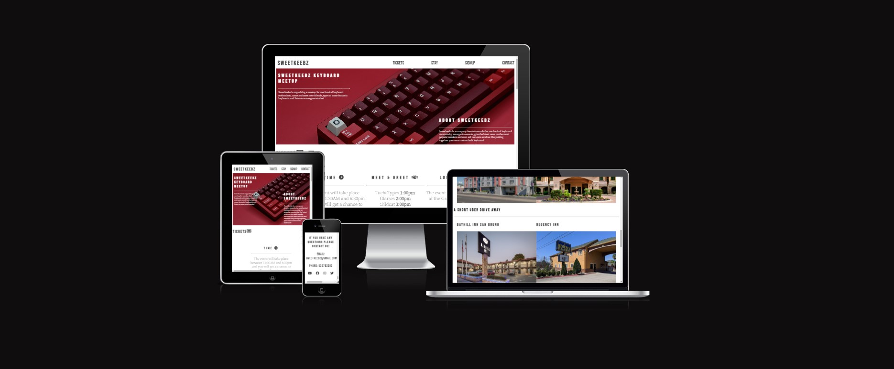
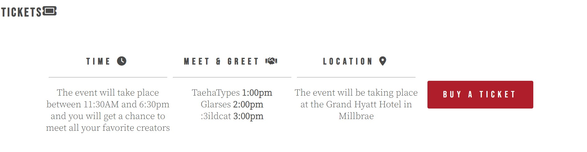
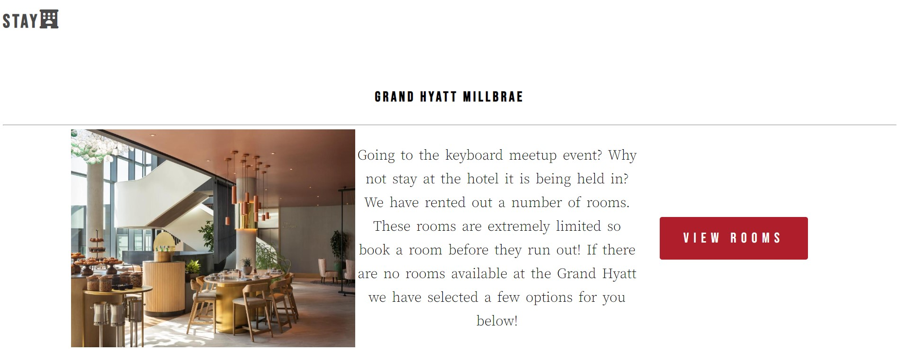
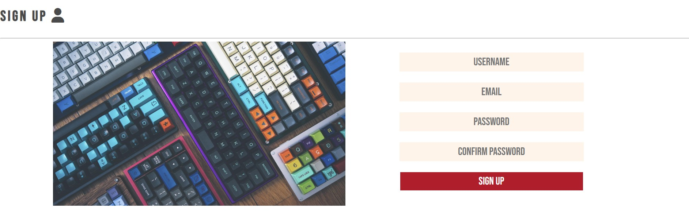

# Sweetkeebz

Sweetkeebz is a website for mechanical keyboard enthusiasts. This website in particular is meant to be an informational page about an event that Sweetkeebz as a company is hosting. 

Users of this website will be able to find information about what time the event starts and ends, where it is being held and where you can spend your night if you are staying over a couple of days. Users will also be able to sign up with their own Sweetkeebz account in order to buy a ticket to the meetup.

## Features

### navigation

The navigation shows in the top right corner of the page, it features links which takes you to the ticket, stay, signup, and contact sections respectively

### Ticket section

The ticket section displays information about the event that is taking place. It also has a button which you press in order to get to the sign up section (a signup is required in order to buy a ticket but as an example project there is no real way to make a purchase.)

### Stay Section

The stay section displays information of where you can spend the night were you to attend to the event. It features a view room button to the main hotel in which the event is taking place. The section also gives you recomendations of hotels which you can stay in if there are no rooms available in the main hotel. 

### Sign up Section

The sign up section allos the user to input a username, email and password in order to make an account. This being an example website, there is no way to make an actual account. 

### Contact Section

The contact section contains contact information to Sweetkeebz as a company. It also features social media links which stands out when the user hovers over them. 

## Testing

* Project is tested on multiple screen sizes to make sure it is responsive

* made sure all external links work as they are supposed to

## bugs

* The CSS file was not loading when I posted the website. I fixed this by removing an unexpected forward slash in the directory of the css file.

* The images in the project were not loading, I fixed this also by removing an unexpected forward slash on every image directory.

## Validator Testing

* HTML 

    The HTML file passes all tests except for 1, it does not want to leave the action field empty but there is no directory for the data input to go.

* CSS 

    The CSS is still not tested as it does not load when i post it.

* Accessibility

    Used lighthouse to make sure the site it readable and accessible

    [image]()

## Deployment

* The site was deployed to GitHub pages according to the following steps 
    * Navigate to the Settings tab in the GitHub Repository
    * Select pages in the Code and automation section in the drop-down menu on the left.
    * Selecting pages should display the link to you

Here is the live link https://kevjohber.github.io/HTML-CSS-Project-1/

## Credits

### Content
* the social media links were taken from the Love Running Project

### Media
* images were taken from google images
